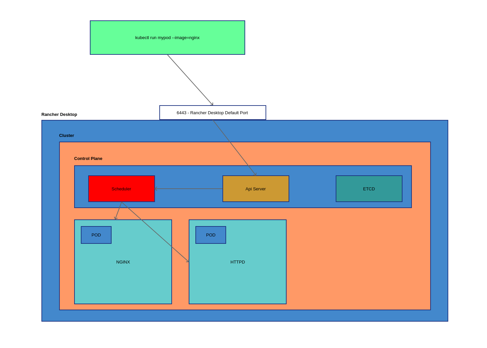

# Kubernetes Masterclass for Beginners Lab

### Kubernetes is like the operating system of the cloud. 

<p>
It can host multiple VM machines that contain docker images. If it receives a web request, it would be able to route the request to a VM and then to the container so the job could be done. In a Kubernetes setup, each VM would be called a woker node. Ex. Tell Kubernetes that I want 3 replicas of this image using a yaml file: linkding. Kubernetes doesn't need a load balencer. It would look at the existing worker nodes (VMs) in order to try to figure out which worker node is able to handle the image. Ex. If we had a run a few hundred docker containers, it would be very hard to do the same thing using Ansible and a load balencer. Kubernetes is able to calculate how many nodes it would need to fulfil the request. Kubernetes is able to detect a container failing and then based on the configuration, it would remove the failing container and create a new one in order to continue fufilling the initial request that was made using the yaml file. Kubernetes is one of the best if not the best ways of running containers at scale. Examples of scaling up and down : If we have a website that is about news, we found out that people that mostly read the paper in the morning. We could plan that we have more instances based on the requested load and scale up or down the clusters as needed. Kubernetes is also able to scale up or down based on current metrics like cpu usage, memory usage and the number of incomming requests.
</p>

<p>
A pod is a collection of containers that can run on a host. A pod is also the smallest element on a kubernetes cluster. This pod resource is created by clients and scheduled onto hosts. A pod is also a collection of other resources. Pods can be single containers, multi containers, init containers. ex. An initcontainer is a special container that is initialized before ther others containers. ex. It can check database connections, volumns and network connections. If one of these happen to be down or offline, it would not start and the pods that require the initcontainer would fail. This is the expected behavior.

Because pods can have associated volumnes, each container in a pod can also share the same resources like a volumnes as well as network properties.

</p>

Check out the Kubernetes docs here : https://kubernetes.io/docs/home/ and here https://kubernetes.io/docs/reference/kubectl/quick-reference/


### Rancher desktop

<p>
Rancher desktop allows one to see and manage docker containers like Docker desktop. So if I spawn a docker container on the command line, I'll see it in Rancher desktop.

The Control Plane of Kubernetes is what is controlling the management of the pods. It has a scheduler, api server and it uses ETCD as it's configuraiton holder.

Troubleshooting:
1) It helps to reset the Rancher desktop configuration via the gui interface in a test system. 
2) It could also help to rename the configuration directory and to relaunch Rancher desktop so it would make the configuration again.
</p>

## Setup

I followed the following setup in order to install all the needed utilities and packages.

1) Installation of KVM on the host machine (Manjaro)
	libvirt, virt-manager

2) Installation of Rancher Desktop
	https://docs.rancherdesktop.io
	When rancher desktop is opened, it will install packages as well as well as create a virtual machine so that it could be able to create and manage the kubernetes cluster. k3s is a package that would help manage kubernetes cluster using and without using rancher desktop.

3) Installation of Homebrew (a prerequisite of the setup)
	brew install kubectl k9s

4) Installation of more packages
	sudo apt install tmux vim

5) Installation of VsCode and install the YAML language support tool from Red Hat. It has built in Kubernetes support as well.

6) Bash setup 
- source <(kubectl completion bash) # set up autocomplete in bash into the current shell, bash-completion package should be installed first.
- echo "source <(kubectl completion bash)" >> ~/.bashrc # add autocomplete permanently to your bash shell.
- alias k=kubectl
- alias kgp="kubectl get pods"
- complete -o default -F __start_kubectl k
- export EDITOR='nano'
- export VISUAL='nano'


Commands 

**kubectl get pods**
- No resources found in default namespace -- Meaning it is already connecting to the Kubernetes cluster.
- kubctl has tab completion to help us out on the command line.

**kubectl get pods -A**  or **kubectl get pods --all-namespaces**
- See parts of the kubernetes cluster as well as their status and age. System namespaces will show up using this command.

**kubectl get pods -o wide**
- Set basic information about the pods including the running status, the ip address that was assigned or generated automatically by the control plane, the name of the pod and the uptime of the pod.

**kubctl get pod podname**
- Get information about a single pod

**kubctl get pod podname -o yaml**
- Get information about a single pod but in the yaml format

**kubectl edit pod podname**
- Allows the yaml file of the pod to be edited using the yaml format. <i>It is not considered a good practice to edit the yaml file in development nor in production but it is possible.</i>

**kubectl describe pod podname**
- Allows you to see the definition of the pod in a hiearchy format. Ex. If you edited the pod by adding a label for example, you'll be able to see the modifications using this command.

**kubectl describe pod podname**
- This command will describe the pod like it's container id, status, information about the ip address and ports as well as the history of it being created

**kubectl delete pod podname**
- Deletes the pod with the given name

**cat ~/.kube/config**
- See the configuration file that kubernetes created after the setup.

**k9s**
- See the pods running and get get informaiton like CPU and memory usage. It's like htop but for kubernetes.
- Press 0 to see all of the pods.

**kubectl run nginx-yaml --image=nginx --dry-run=client -o yaml**
- Using the dry run command, we can create a basic yaml file based on the image that we want. Then we can build our yaml file from that.
- The following is an example of a very basic yaml file. Part of it was deleted because some elements were not required. It was created using the dry-run option above. 

```
apiVersion: v1
kind: Pod
metadata:
  labels:
    run: nginx-yaml
   method: fromcode
  name: nginx-yaml
spec:
  containers:
  - image: nginx
    name: nginx
```

**kubectl create -f /some/path/podfilename**
- Creates the pod based on the file name.

**kubectl apply -f /some/other/path/podfilename**
- Creates the new pod and/or applies the changes to an existing pod with the same name.

## Running commands in a pod

**kubectl exec -it podname -- /bin/sh or kubectl exec -it podname -- /bin/bash**
- Enter into the pod with the given name and gives you access to a shell command.

**kubectl exec podname -- ls -la /usr**
- Example of how to list the contents of the /usr directory in the first container in the pod.

**kubectl exec podname -- date**
-- Example of how to get the date of the first container in the pod.

**kubectl exec -it httpd  -- /bin/bash**
- After we have gotten the ip address using <b>kubectl get pods -o wide</b> command for example, we can use the ip address within the first container of the pod. Ex. We can even install htop within the pod to see the processes running.
- It is very helpful to poke around within a container but it might require you to install certain packages. 
ex. api update
app install iputils-ping && app install curl && app install nano && app install telnet && app install htop


**kubectl exec podname -c containername -- date**
- Example of how to get the date from a specific container in the pod.

**kubectl create deployment**
- Deployments can be created using various combinations of the create deployment command. One could specify the name of the pod, the name of the images, including how many replicas are to be created. ex <b>create deploy test --image=httpd --replicas=3</b>

**kubectl get deployments.apps**
 - Shows the deployments that were deployed using the <b>kubectl create deployment</b> command.

 **kubectl edit deployments.app**
- Allows you to edit the deployment yaml that was created when you ran the <b>kubectl create deployment</b> command.

**kubectl describe deployments.apps deploymentname**
 - This command just does what it says. It is very similar to the same command but for looking at the details of a pod. Be very sure you look at the events section to better try to understand what is going on. The deployment might need to be debugged and that is a very good way of understanding what is going on.

 **kubectl delete deployments.apps deploymentname**
 - Allows one to delete the deployment for the deploymentname.

 **kubectl create deploy test --image=httpd --replicas=10 --dry-run=client -o yaml > deploy.yaml**
 - Allows one to quickly generate the deployment yaml file based on the command line parameters.

## Replicas or Replica sets
- Replicas or replica sets are managed by Kubernetes using deployments and deployment commands and we never need to manage them outselves. You can see what is happening by running a few commands to better understand the process. <b><i>Be aware that some old replicas will still hang around even after new replicas come online.</i></b>

**kubectl get replicasets.apps**
- Lists the replica sets controlled by kubernetes.

**watch -n 1 "kubectl get pods"**
- Runs a command every second. A nice way to see what is happening after we apply a command like kubctl create deployment... 

**kuvectl apply -f deploymentfile.yaml**
- Applies/reapplies the deployment file. If the base image has changed, the deployment will be redone. If the deployment strategy has changed then the deployment is not going to change. It's just a configuraiton change. It is better to use the RollingUpdate stragegy along with maxUnavailable : 1 and maxSurge : 1 so that the updates to the pods won't be so brutal for the end users. When the containers are coming up, kubernetes will wait until the status is ok before moving ahead to the other containers. 

If we simulate an error in our container and we reapply the deployment, we will see that the deployment will have an error status and then it will go to another status called CrashLoopBackOff and we will have an number of restarts.

Below is how we can cause an error by overriding the normal image process. It will return an error code of 1 instead of returning 0.

```
apiVersion: apps/v1
kind: Deployment
metadata:
  labels:
    app: test
  name: test
spec:
  replicas: 10
  selector:
    matchLabels:
      app: test
  template:
    metadata:
      labels:
        app: test
    spec:
      containers:
      - image: httpd:2.4.64-alpine3.22
        name: httpd
        command: ["/bin/bash","-c"] # override the default command
        args: ["sleep 5; exit 1"] # sleep for 5 seconds and then exit with an error
  strategy:
    type: RollingUpdate
    rollingUpdate:
      maxUnavailable: 1
      maxSurge: 1
```

**This is visual representation of the pods configration**
- When a command is made, it needs to be sent to the api server running in the control plane. 
- The API server talks with the scheduler.
- The control plane handles managing of the pods including scheduling.
- The scheduler will need to schedule a pod if needed. Based on the incomming command, the scheduler wiil assign containers to a node in the cluster based on the requirements of the pod. ex. 2 gigs of ram..., enough capaticy.

- The ETCD is like the "brains" of the control plane.


